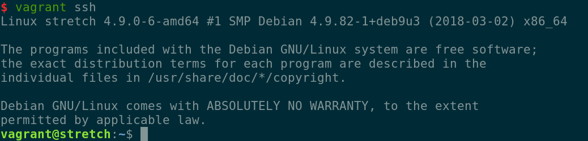

# Catalogue Collections

# Requirements
* Python 3.5 >= (https://www.python.org)
* Django 2.0 >= (https://www.djangoproject.com)
* Django Rest Framework 3.0 >= (http://www.django-rest-framework.org)
* PostgreSQL 9.6 >= (https://www.postgresql.org)


## Dev Enviroment Deploy

#### 1. Instale o vagrant
  * https://www.vagrantup.com

#### 2. Crie um diretório para o projeto.
Se estiver usando linux, faça:
```
$ mkdir 2018_debian9_django_cataloguecollections
$ cd 2018_debian9_django_cataloguecollections
```

#### 3. Instale um S.O. virtualizado (recomentação: Debian 9 ou Ubuntu 16.04)
```
$ vagrant init debian/stretch64
$ vagrant up
```

#### 4. Logue na máquina
```
$ vagrant ssh
```
Você verá uma tela assim:


para virar root:
```
$ sudo su
```

#### 5. Dependencias externas

##### 5.1 Instale Python3, faça o preset como versão padrão e instale o virtualenv
```
# apt update
# apt install python3
# echo "alias python=python3" >> ~/.bashrc
```

verifique se possui o pip instalado:
```
$ pip --version
```
Instalação: https://pip.pypa.io/en/stable/installing/

Instale o virtualenv
```
# pip install virtualenv
```

#### 5.2 Instale o PostgreSQL
```
# apt install postgresql
```


#### 6. Dependencias internas

Crie o env:

```
$ virtualenv env
```

Ative o env:
```
$ source env/bin/activate
```

* Crie a base:
```
$ python3.5 manage.py migrate
```

## Atalhos

### Rodando a aplicação localmente
1. Ative o env
2. Rode o runserver
```
$ python3.5 manage.py runserver
```


### References
* UWSGI
  * https://docs.djangoproject.com/pt-br/2.0/howto/deployment/wsgi/uwsgi/
